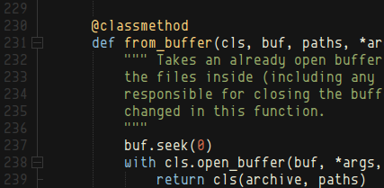

Boron theme for Komodo Edit/IDE
===============================

A port of the Boron theme for [Komodo Edit](http://komodoide.com/komodo-edit/)/[IDE](http://komodoide.com/).

It is based on the [Boron theme](https://github.com/mjio/boron.tmtheme) for
[Sublime Text](http://www.sublimetext.com/) by
[Martin Jagusch](https://github/com/mjio), which is itself based on the
[Jellybeans](http://www.vim.org/scripts/script.php?script_id=2555) theme for
[Vim](http://www.vim.org/).

Installation
------------

Open `boron.ksf` with Komodo Edit.
